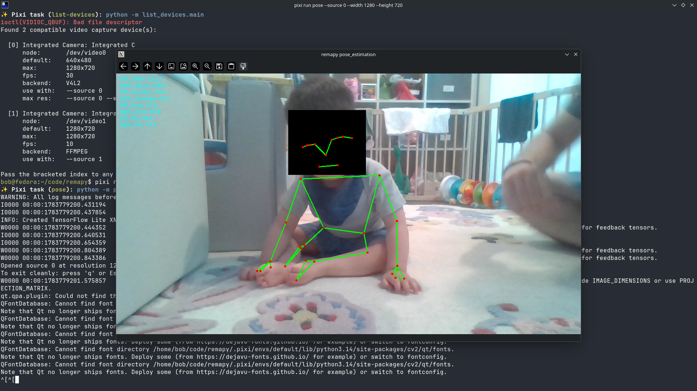

# remapy
Playing with tools inspired by Remy's therapies

**NOTE: This is a work in progress**

Remy + therapy + python = remapy

Much of this is implemented using Claude code and other coding LLMs. I build similar tools to sample sensors from embedded systems and process them in my day job. 

## Motivation

My son Remy has a rare genetic syndrome that causes global developmental
delays, in both movement and cognitive function (more at
[rareremy.org](https://www.rareremy.org)). While we pursue therapeutic development
and medical research, most of our day-to-day energy goes into physical and
occupational therapy with him.

remapy is a place to build tools that motivate Remy in those therapies and that can
track changes in his abilities before they're visible in his gross actions. If
therapeutic development advances to a clinical trial, the same tools can help
establish a baseline of his abilities before treatment and measure progress or
change afterward.



## References

Standard, clinically validated exercises and scoring systems this project draws on
for motor-development metrics:

- **GMFM-88 — Gross Motor Function Measure.** 88 items across five dimensions
  (lying/rolling, sitting, crawling/kneeling, standing, walking/running/jumping),
  each scored 0–3.
  [CanChild overview](https://canchild.ca/en/resources/44-gross-motor-function-measure-gmfm) ·
  [Physiopedia](https://www.physio-pedia.com/Gross_Motor_Function_Measure) ·
  [User's Manual (Mac Keith Press)](https://www.mackeith.co.uk/book/gross-motor-function-measure-gmfm-66-gmfm-88-users-manual-revised-3rd-edition/)

Not currently used:

- **PDMS-3 — Peabody Developmental Motor Scales, Third Edition.** Gross-motor
  subtests (Body Control, Body Transport, Object Control) plus fine-motor and a
  supplemental physical-fitness subtest.
  [Pearson](https://www.pearsonassessments.com/en-us/Store/Professional-Assessments/Motor-Sensory/Peabody-Developmental-Motor-Scales,-Third-Edition/p/P100049000) ·
  [WPS](https://www.wpspublish.com/peabody-developmental-motor-scales-third-edition.html) ·
  [PAR](https://www.parinc.com/products/PDMS-3)
- **AIMS — Alberta Infant Motor Scale.** 58 observational items across prone,
  supine, sitting, and standing positions, norm-referenced from birth to 18 months.
  [Physiopedia](https://www.physio-pedia.com/Alberta_Infant_Motor_Scale_(AIMS)) ·
  [Score sheets (Elsevier)](https://www.us.elsevierhealth.com/alberta-infant-motor-scale-score-sheets-aims-9780323798426.html)

## Android app

`android/` holds a live-view Android port: camera + pose skeleton + live motor metrics, for an
**observer** watching Remy (he never looks at the screen). Nothing is recorded — the desktop
pipeline stays canonical for recordings, annotations and the cross-session trend. Faces are
redacted before anything reaches the screen. Deeper notes, including what is deliberately not
ported and what is still unverified, are in [`android/CLAUDE.md`](android/CLAUDE.md).

It is a **separate Gradle build**, not part of the pixi workspace.

### Option A: Android Studio

The simplest route, and it sidesteps the SDK/JDK/`adb` setup below entirely — Studio bundles its
own JDK and manages the SDK for you.

**Open `android/`, not the repository root.** The root has no `settings.gradle.kts`; Studio would
just see a folder of Python. (The Python side stays in your editor of choice — the two builds are
independent.)

Requires **Android Studio Quail 2 (2026.1.2) or newer**, because the project is on AGP 9.3 and
Studio refuses projects whose AGP is newer than it supports. Quail 2 is the current stable release,
so a fresh download is fine; an older install will need updating.

After it syncs, the green **Run** button builds, installs and launches on a connected phone or an
emulator, and Logcat is right there — which is how the two bitmap bugs in the pipeline were found.
The metrics tests run from the gutter icons in `metrics/src/test/…`, or via the Gradle panel.

If Studio installs its own SDK rather than reusing `~/Android/Sdk`, point the build at it:
`echo "sdk.dir=<studio-sdk-path>" > android/local.properties`.

### Option B: command line

One-time setup. Install the Android SDK (skip if you already have Android Studio — point
`ANDROID_HOME` at its SDK):

```bash
mkdir -p ~/Android/Sdk/cmdline-tools
# Grab the current "Command line tools only" Linux zip from
# https://developer.android.com/studio#command-line-tools-only, then:
unzip commandlinetools-linux-*.zip -d /tmp/cmdline
mv /tmp/cmdline/cmdline-tools ~/Android/Sdk/cmdline-tools/latest
```

**Put the SDK tools on your `PATH`** — this is what makes `adb` available, and it is the step that
trips people up, because `adb` ships *with the SDK* and there is nothing separate to install:

```bash
cat >> ~/.bashrc <<'EOF'
export ANDROID_HOME="$HOME/Android/Sdk"
export PATH="$ANDROID_HOME/platform-tools:$ANDROID_HOME/cmdline-tools/latest/bin:$PATH"
EOF
source ~/.bashrc
```

Do **not** `apt install adb` on top of this. You would end up with a second, older `adb` ahead of
the SDK's on `PATH`, and mismatched clients fight over the adb server port
(`adb server version doesn't match this client`).

Then accept the licences and install the packages the build needs:

```bash
yes | sdkmanager --licenses
sdkmanager "platform-tools" "platforms;android-37.0" "build-tools;36.0.0"
```

(Build-tools 36 is not a typo — it is what AGP 9.3 picks by default even at `compileSdk = 37`. If
you get the version wrong, Gradle downloads the one it wants on the first build anyway, since the
licences are already accepted.)

Finally, from the repository root, point the build at the SDK:

```bash
echo "sdk.dir=$HOME/Android/Sdk" > android/local.properties
```

Verify with `adb version` (expect platform-tools 37.x) and `cd android && ./gradlew :metrics:test`,
which runs the metrics suite with no device and no phone attached.

### Connecting a phone

Steps 1-3 apply whichever route you took; only the last step differs. The APK is debug-signed —
fine for sideloading, not distributable. Needs Android 8.0 (API 26) or newer on an arm64 device.

1. On the phone: Settings → About phone → tap *Build number* seven times, then
   System → Developer options → **USB debugging**.
2. Plug it in and accept the *Allow USB debugging?* prompt.
3. `adb devices` — it should list as `device`. (In Studio the phone appears in the device
   dropdown instead; `adb` is bundled, so this check works there too via its terminal.)
4. Install and launch it:
   - **Studio** — pick the phone in the device dropdown and hit **Run**.
   - **Command line** — `cd android && ./gradlew :app:installDebug`, then open **remapy** from the
     app drawer.
5. Grant the camera permission when asked.

For a phone already on a tripod, wireless works too (Android 11+): Developer options →
*Wireless debugging* → *Pair device with pairing code*, then `adb pair <host>:<port>` with that
code, and `adb connect <host>:<port>` using the different port on the main wireless-debugging
screen.

### If `adb devices` doesn't say `device`

Three distinct failures, three different fixes:

| What you see | Cause | Fix |
| --- | --- | --- |
| `adb: command not found` | SDK tools not on `PATH` | the `~/.bashrc` block above; open a new terminal |
| `unauthorized` | the on-phone prompt was not accepted | unplug, replug, tap **Allow** (tick "always allow") |
| `no permissions` | udev rules missing (Linux only) | `sudo apt install android-sdk-platform-tools-common`, then replug |
| *(empty list)* | cable is charge-only, or USB debugging is off | try another cable; re-check step 1 |

On the udev case: that package installs **only** a rules file — no binaries, so it cannot shadow
the SDK's `adb`. Its rule carries `TAG+="uaccess"`, so on a systemd desktop you do **not** need to
join the `plugdev` group, despite what most guides say. Many setups need none of this; check
before fixing.

### What to look at at the start of a session

The app has been run on a real device against a real person, in both hold and crawl modes. These
are not one-time checks though — the overlay shows the things that move between sessions:

- **`fps`** — green at ≥ 13.5 (90 % of the 15 Hz grid). Below that the filter chain is resampling
  *up* and inventing correlated samples. The `gpu`/`cpu` label beside it is the first thing to
  suspect. The app caps itself at 15 to match the grid, so a healthy reading sits at 15, not above.
- **`coverage`** — green means the torso landmarks are trusted. Metrics read `--` rather than a
  stale number when it drops; that is the intended behaviour, not a bug.
- **`up world_y`** — a reminder that the vertical assumes a level camera.
- **The face redaction** — confirm a face is actually covered before pointing this at anyone. A
  fully black frame means no face was located and the app blanked it rather than risk showing one.

## TODO

- [x] increase IMU sampling rate to at least 50, ideally 100 Hz — **100 Hz over USB serial, 50 Hz
      over BLE**, both measured at 100 % of nominal
- [x] measure streaming throughput compared to nominal sampling rates — `--stats` now reports a
      device-clock rate + max gap alongside host arrival rate; this is how the above was verified,
      and it caught the rate silently decaying with board uptime
- [x] baseline IMU signal stats at rest — see
      [Sensors](adafruit_feather_sense/README.md#sensors) (accel RMS σ ≈ 0.0102 m/s², gyro
      ≈ 0.0021 rad/s at the shipped ODR 208)
- [x] implement metrics from standard exercises and scoring defined in GMFM-88 — **four trials
      (sitting hold, sit↔prone transition, belly crawl, supported standing), offline, camera-only**.
      The instruments score *ordinally* (GMFM items are 0–3), which is too coarse to show change:
      Remy can sit at a "2" for a year while genuinely improving. So the items are not
      reimplemented — each one defines a reproducible *trial*, and `motor_metrics/` measures the
      **continuous variable underneath it** (hold duration and postural sway; transition smoothness
      via SPARC; crawl cadence and left–right reciprocity). Label trials with `pixi run annotate`,
      then `pixi run metrics` / `notebooks/motor_metrics.ipynb`
- [x] compute metrics in real time (GUI overlay) as well as offline — **the tilt-robust,
      trigger-free subset**: `pixi run live` (sway + trunk lean) / `pixi run live-crawl` (cadence +
      cycle variability, for **both arms and legs** — the crawl overlay leads with the legs and a
      "favors one leg" readout, since that is where Remy's signal is), or `--live-metrics` on `pose`
      and `rerun`. `motor_metrics/live.py` feeds a
      rolling window to the *same* `hold_metrics`/`crawl_metrics` the offline table uses. Cost was
      never the obstacle (~3 ms per recompute against a 67 ms frame); the constraints are that the
      Savitzky-Golay fit leaves the last 2 samples extrapolated — so the readout is deliberately
      133 ms old, where it equals the offline value *exactly* — and that without an annotator there
      is no honest trial boundary, so the window is fixed and **nothing infers movement onset**.
      SPARC, submovement counts and any duration metric are therefore still offline-only: they need
      an onset/offset the code is not entitled to invent. Live values never enter the `.h5` or the
      offline table (different window, different measurement)
- [x] child-facing live display — the same readout driving something motivating rather than a
      numeric overlay. Note "held for N seconds" is *not* available (that is the loss-of-posture
      inference `motor_metrics` refuses); "coverage green and trunk within X of its own baseline" is.
      **First piece landed:** `pixi run live` now draws a sit-hold *steadiness meter* — a
      red→green fill bar reading good-vs-bad on a continuum, built on the trunk's deviation from its
      *own* rolling baseline (so a tilted camera shifts the baseline, not the score) rather than an
      absolute upright angle. Still a numeric overlay around it; the game/animation layer is the rest.
      **Second honest signal available:** live crawl now reports `live_leg_amplitude_symmetry` — a
      continuous "favors one leg" reading (0 = even, sign = side) that survives a tilted camera (it
      reads no vertical). It is the natural driver for a *use-both-legs* game — reward closing the
      gap toward even — the direct counter to Remy favoring one leg. Only the meter is drawn so far;
      wiring either signal to something motivating is the open work
- [x] refactor parts of CLAUDE.md into distributed rules, skills, hooks, commands, etc. All context is not needed for every prompt.
- [ ] fuse the Feather Sense IMU into the metrics — blocked on camera↔IMU clock alignment: the
      recording stores the device clock (ms since board boot) but not its offset to the host
      timeline. Would give a true gravity vector (no level-camera assumption) and 100 Hz sway
- [ ] program feather sense in C++ with Zephyr RTOS, or embedded Rust (embassy-nrf and nrf-hal)
- [ ] program feather sense in embedded Rust (embassy-nrf and nrf-hal). Use schematics from adafruit to build BSP.
- [~] port to Android — live view only (camera + pose + live metrics, observer-facing). The metrics
      kernel is reimplemented in Kotlin and pinned to the Python one by exported goldens
      (`pixi run export-fixtures`); the app builds, runs, and redacts. **Not yet run against a real
      camera or a real child**, and phone-vs-laptop landmark parity is unmeasured — until it is,
      an Android session is a new baseline, not a continuation of the laptop trend. Build/install
      steps and what to check on a first run: `android/CLAUDE.md`
- [ ] consider multiple camera views
- [ ] consider adding a depth camera
