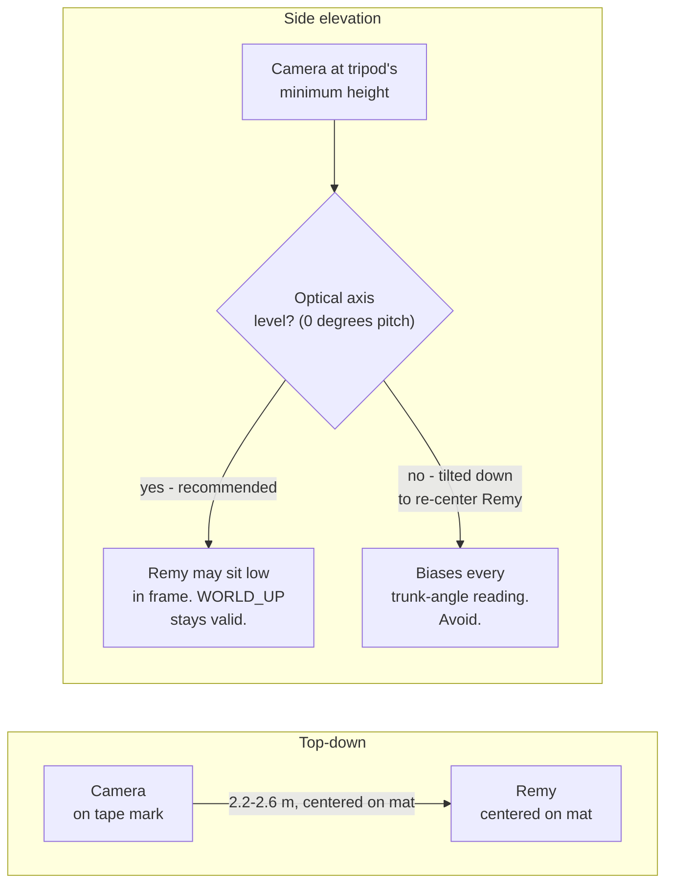
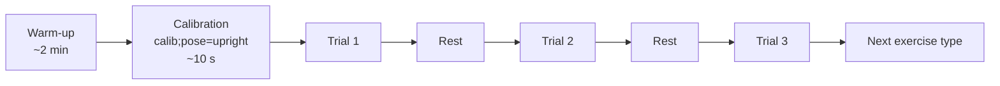

# Data Collection Protocol — Verification & Validation

*remapy / motor_metrics · rev. 2026-07-24*

A single-subject measurement plan for confirming that the sitting, transition, crawl, and standing metrics reflect Remy's real movement — not artifacts of the camera, the model, or the filter chain.

| | |
|---|---|
| **Subject** | n = 1 (Remy) |
| **Instruments under test** | hold · transition · crawl |
| **Design** | Single-case, repeated-measures |
| **Reference standard** | Manual video reference (no lab hardware) |

## Purpose and how to read this document

*Verification* — does the code compute what it claims to compute — is already done: `tests/test_motor_metrics.py` checks every metric against closed-form oracles (a constructed lean angle, a polygon's exact perimeter, a known sine frequency) and 441 tests pass. That is a code-correctness question and this document is not about it.

*Validation* is a different question: do the numbers that code produces reflect something real about Remy's movement? That can only be answered with data collected on purpose, and this document is the plan for collecting it.

Every published reliability figure for this class of measurement comes from group studies (n = 10–20+) using ICC, which is a between-subject statistic — it needs variance *across people* to mean anything. With one child, that tool doesn't apply. This protocol instead follows single-case experimental design (SCED) practice: repeated within-subject measurement, an explicit estimate of measurement error from repeat trials, and known-contrast checks in place of a population reference range.[^1]

## Three separate questions, not one

"Is this metric valid?" is really three questions, and a session that answers one does not automatically answer the others. Design each collection day around which question it is for.

| Question | Answered by | Applies to |
|---|---|---|
| **Reliability** — if nothing changed, does the number stay put? | Same-day repeat trials; report SEM & MDC95 (see Reliability sub-study, below) | All metrics |
| **Concurrent validity** — does it agree with an independent way of measuring the same thing? | A manual reference measurement collected alongside the camera (see Concurrent validity, below) | Duration, scale, trunk angle, cadence, reciprocity |
| **Sensitivity** — does it move when something really did change? | A within-session fatigue contrast, and month-over-month trend (see Sensitivity, below) | Sway, SPARC, cadence |

> **Known ceiling.** Sway (path length, ellipse area, RMS) has no concurrent validity check available in this protocol — there is no force plate or marker-based system at home. Treat sway numbers as the least independently confirmed family here; the Concurrent validity section gives the closest available proxy, and that is a real limitation, not an oversight (see Limitations).

## Why this needs to be a careful protocol

Two published numbers set expectations before a single frame is recorded.

### Even gold-standard hardware is only moderately reliable in this exact population

A study of infant sitting postural control in children with or at risk of cerebral palsy — Remy's own reference population — used a **240 Hz force plate**, three trials of 8.3 s per session, across 18 infants (mean age 13.1 months).[^2] Even with that hardware, inter-session reliability for the linear sway measures came back only moderate:

| Measure | Inter-session ICC (mean) | Range |
|---|---:|---:|
| RMS, anterior–posterior sway | 0.59 | 0.44 – 0.78 |
| RMS, medio-lateral sway | 0.55 | 0.25 – 0.70 |
| Sway path length | 0.43 | 0.25 – 0.57 |

That is the reliability ceiling with a purpose-built lab instrument. A single 30 Hz webcam should be expected to do *no better* — the honest goal of this protocol is knowing how much worse, not assuming the camera can match a force plate.

### Landmark noise is the same order of magnitude as the signal

Marker-free pose estimation compared against marker-based motion capture shows roughly 47% of landmark position errors under 20 mm, 80% under 30 mm, and about 10% exceeding 40 mm.[^3] Remy's postural sway is measured in single-digit centimeters — so landmark noise is not a rounding error next to the signal, it is on the same scale as it.

The meters those numbers are denominated in are themselves a model output. `landmarks_world` is metric because MediaPipe *estimates* a body scale from the pose, not because anything in the scene was calibrated — so an object of known size held in frame cannot check it (the pose landmarker emits only the 33 body points; a rod never gets coordinates, and its size constrains nothing in the model's estimate). The scale check in Concurrent validity below therefore compares the model's estimate against a tape-measured *body* dimension, which is the only reference this pipeline can actually be held to.

### The landmarks the metrics actually depend on

Every metric in this package reads from a fixed subset of MediaPipe's 33 body landmarks — mainly the shoulders and hips (11, 12, 23, 24), which define the trunk vector every hold and transition metric is built on, and the wrists (15, 16), which drive the crawl signal. Camera framing (below) has one job: keep all of these in frame and unoccluded for the whole trial.

*Fig. 1 — The 33-point MediaPipe Pose landmark map. Shoulders/hips (11, 12, 23, 24) and wrists (15, 16) are load-bearing for every metric in this package. Source: Google AI Edge, [Pose landmark detection guide](https://developers.google.com/edge/mediapipe/solutions/vision/pose_landmarker), licensed [CC BY 4.0](https://creativecommons.org/licenses/by/4.0/).*

## Fixed setup — identical every session

Every metric assumes the camera doesn't move and doesn't tilt between sessions (`signals.WORLD_UP` takes the camera's own vertical axis as "up," which is only true if the camera is level). Fix the physical setup once, mark it, and don't re-eyeball it each time.

**Level (zero pitch) is the load-bearing requirement — mounting height is not.** `WORLD_UP` depends on the camera's optical axis being horizontal, not on the camera physically sitting at any particular height. If a tripod's minimum height is above Remy's seated hip height, mount it there anyway and keep it level; he will simply sit lower in the frame. That preserves `WORLD_UP` exactly. What breaks it is tilting the camera down to re-center him in a higher-mounted frame — that pitch rotates the camera's own "up" away from true vertical by roughly the tilt angle, and every `trunk_from_vertical` reading inherits that offset. Height only matters for a smaller, secondary reason: keeping Remy near the camera's principal axis limits ordinary lens-perspective distortion toward the frame edges.

*Fig. 2 — Fixed camera geometry (schematic, not to scale). Mount at whatever height the tripod allows; the branch that matters is whether the optical axis stays level, not the physical height. Mark camera and mat position with floor tape so distance and framing repeat exactly across sessions; check level with a bubble level or phone level app before every recording, since `trunk_from_vertical` assumes it.*

- [ ] **Camera level** — check with a bubble level or phone level app resting on the camera body, every session, before recording. This is the single assumption every trunk-angle and sway number depends on, independent of mounting height.
- [ ] **Fixed distance** — mark camera and child positions with floor tape (Fig. 2) so framing, and therefore `com_norm` speed scaling, stays comparable across sessions. If a taller tripod pushes the camera well above hip height, increasing this distance shrinks the framing problem — the offset between camera height and Remy's torso height subtends a smaller angle from farther away — which is the fix to reach for before ever tilting the camera.
- [ ] **Full-body framing check** — at your fixed height and distance, confirm shoulders, hips, and both wrists sit inside the frame with margin, even with Remy sitting lower (or higher) than center. This is what a taller-than-ideal mount actually costs — a framing constraint, not a validity one.
- [ ] **Same surface and lighting** — same mat, same room, similar time of day, to keep visibility/presence scores comparable rather than confounding "worse tracking" with "different room."
- [ ] **Body-scale reference — measured off-camera, not held in frame.** With a tape measure, record Remy's shoulder width (acromion to acromion) and hip width in the session notes; re-measure monthly, since he is growing and a stale number would read as scale drift. This is what the scale check in Concurrent validity compares against. Nothing goes in the frame for it — the check runs offline against the `calib` segment.

> **If a fixed tilt is truly unavoidable,** measure it precisely (protractor or level app, not by eye) and reproduce that *exact* angle every session — a tripod head without an angle detent makes this harder than it sounds, and an inconsistent tilt turns a one-time bias into session-to-session noise, which is worse for trend detection than a constant offset would be. Do not lean on `signals.estimate_up()` to correct for it: that function cannot distinguish "the camera is tilted" from "Remy isn't sitting vertically," and for a child with a developmental delay the second possibility isn't negligible — using it here would reintroduce the exact confound this setup is designed to avoid. Increasing distance (above) is the lower-risk fix.

## Session structure

Every session opens with a calibration segment and then repeats each exercise type in short blocks with rest — mirroring the three-trials-per-type design used in the infant CP sitting study cited above, which is the closest published precedent for this exact population.

*Fig. 3 — Session structure for one exercise type; repeat for each of the four exercise types, order rotated session to session. Trial length varies by exercise: sitting/standing holds run until Remy loses interest or posture, transitions and crawl bouts are naturally short. Rest between trials is unhurried — this is not a timed clinical exam.*

- **Always start with `calib;pose=upright`** — this is the vertical-reference diagnostic the notebook checks before trusting any hold number (see Data quality gates, below). Skipping it on a "quick" session is the single most common way to silently invalidate a day's data.
- **Three trials per exercise type, per session**, matching the infant-CP sitting study design cited above. If Remy tires before three, record what you get and note it — a two-trial day is still usable, just wider in its error estimate.
- **Rotate exercise order across sessions** (sit → stand → transition → crawl one day, crawl → sit → transition → stand the next) so fatigue doesn't systematically penalize whichever exercise is always last.
- **Label immediately, in the vocabulary** — `sit_hold;arms=free;support=none`, not free text. A typo surfaces in `metrics_table()`'s `warnings` column, but only if the label was structured enough to be checked at all.

## Reliability sub-study — estimating measurement error

Run this as a focused three-week block before leaning on the metrics for a longitudinal trend. The goal is a number for how much a metric can move *with nothing real going on*, so that later, a real change can be told apart from noise.

### Schedule

Two sessions per day, separated by at least two hours (e.g., late morning and late afternoon), on 3 days per week for 3 weeks — nine same-day pairs in total. Same-day pairing holds developmental change effectively constant, so any difference between the morning and afternoon session is measurement error, not Remy.

### Analysis — adapted for n = 1

> **Why not ICC.** The classic reliability coefficient (ICC) is a ratio of between-subject variance to total variance — it requires variance *across people*, which doesn't exist with one child. Use the within-subject form instead, which is exactly what the repeated trials give you directly.

1. For each metric, pool the repeat trials within a same-day pair (or across all three trials in a block) and compute the **within-day standard deviation**, `SD_within`.
2. **Standard error of measurement:** `SEM = SD_within` (no reliability-coefficient correction needed — this *is* the direct estimate of trial-to-trial noise).
3. **Minimum detectable change:** `MDC95 = 1.96 × √2 × SEM` — the smallest change between two sessions that is more likely real than noise, at 95% confidence.[^4]
4. Report `SEM` and `MDC95` per metric, not a single pooled number — sway and cadence do not share a noise floor.

Until this sub-study is complete, treat any single session-to-session change smaller than the infant-CP study's own inter-session spread (the inter-session ICC table, above) as provisionally within noise — that is the best available prior for the size of measurement error at this population's sway magnitudes, ahead of Remy's own `MDC95` being computed.

## Concurrent validity — an independent check per metric family

No home force plate or marker system exists, so "independent" here means a manual reference a person can produce from the same video — coarser than a lab instrument, but genuinely independent of the pose-estimation pipeline being validated.

| Metric family | Reference standard | Agreement check |
|---|---|---|
| `duration_s` | Stopwatch or video-timestamp read by eye at in/out points | Should match within one frame (33 ms); a sanity check more than a validity test |
| Metric scale (underlies every sway number) | Tape-measured shoulder width from the session notes (Fixed setup checklist, above) | Compare it against the median distance between landmarks 11 and 12 in `landmarks_world` over the `calib` segment. What matters is that the ratio *stays put* across sessions — a step change means MediaPipe re-scaled Remy between sessions, and that session's meter-denominated numbers are not comparable to the rest (angles and ratios are unaffected) |
| `trunk_angle_mean_deg` | Freeze a frame from the `calib` segment; measure trunk angle from vertical with a protractor or inclinometer app on the still image | Should agree with `trunk_from_vertical` to within a few degrees |
| Postural sway (path length, ellipse, RMS) | *No home reference standard exists.* Closest proxy: a second phone camera at a different angle, sway magnitude compared qualitatively (bigger/smaller), not numerically | Confirms sway isn't a single-camera artifact; does not validate the absolute magnitude (see Limitations, below) |
| `cadence_cpm` (crawl) | A rater counts arm-pulls by eye from the recorded video (a stopwatch and tally, or scrubbing frame-by-frame in `annotate`) | Manual count × 60 / trial seconds should track `cadence_cpm_left` / `_right` within a pull or two |
| `phase_offset` (crawl reciprocity) | A rater categorizes the same clip by eye: reciprocal (alternating), symmetric ("bunny" haul), or mixed | `phase_offset` should sit near 0.5 for rater-labeled "reciprocal" clips and near 0.0 for "symmetric" ones |
| `sparc_trunk` (transition smoothness) | *No independent smoothness reference exists* in this or any published protocol — SPARC's value is deliberately self-referential (discussed above, and see `motor_metrics/transition.py`) | Use the known-contrast design under Sensitivity, below, instead of a concurrent reference |

Do the scale and trunk-angle checks on the **first session of every reliability block** at minimum — both are cheap, and both run offline off the `calib` segment. A tilted camera biases every trunk-angle and sway number; a shifted metric scale breaks the comparability of the sway family specifically, which is the one family that carries units.

## Sensitivity — confirming a metric moves when something real changes

Reliability (the sub-study above) asks whether a metric is *stable* under nothing; sensitivity asks whether it *responds* to something. Two designs, on two timescales.

### Short timescale: within-session fatigue contrast

Compare trial 1 against trial 3 within the same session block. Some real, expected change should show up — e.g. sway increasing, or SPARC smoothness degrading, toward the end of a block as Remy tires. If a metric never separates trial 1 from trial 3 across many sessions, either it is insensitive at the resolution this setup can measure, or fatigue genuinely isn't showing up in that exercise — worth distinguishing, not assuming.

### Long timescale: month-over-month trend against informal PT report

There is no independent quantitative score to calibrate against (no PT-administered GMFM series exists for Remy currently — see `CLAUDE.md`). Treat this as a soft check, not a statistical test: when his PT or you independently notice a change in ability, look at whether the trend in the relevant metric (duration, sway, cadence) moved in the same direction over the same window. Agreement is reassuring; disagreement is a prompt to look at coverage/QC (Data quality gates, below) before doubting the metric.

## Data quality gates — check every session before trusting it

These mirror the gating already built into the code (`motor_metrics.quality`, `Gate(min_visibility=0.5, min_presence=0.5)`) — this section is what a person checks by eye, not a restatement of what the code already enforces automatically.

- [ ] **Coverage ≥ 0.8** per trial. Below that, the trial's `coverage` column in `metrics_table()` is telling you MediaPipe lost the torso for more than a fifth of the clip — treat the numbers as provisional, and consider a re-shoot rather than a re-analysis.
- [ ] **`tracked_s` close to `duration_s`**. A big gap means the longest good tracking run inside the marked trial was much shorter than what you marked — usually an occlusion (an arm crossing the torso, someone's hand assisting) mid-trial.
- [ ] **`warnings` column is empty.** Anything there is a label typo (`label_warnings()`) — fix the annotation before treating the row as clean data, not after.
- [ ] **Calibration diagnostic near zero.** The notebook's vertical-reference check (median trunk angle over the `calib` segment) should sit close to 0°. If it doesn't, the camera was tilted for that whole session — re-level before the next one, and treat that session's trunk-angle and sway numbers as biased by an unknown, uncorrected tilt.

> **Discard, don't salvage.** If coverage is below 0.5, or an `exclude`-worthy interruption happened mid-trial, mark the segment `exclude;reason=...` and re-shoot rather than trying to trim around it — `segments.py` deliberately drops a trial that overlaps an exclusion whole, because a hold whose middle is untrustworthy is not a shorter valid hold.

## Data management

- **File naming:** `YYYY-MM-DD_HHMM_<setupid>.h5` — the setup id changes only if the camera is physically relocated, so it flags any session that used a different geometry from Fig. 2.
- **Keep every raw `.h5`, forever.** Metrics are recomputed on read, never written back (the same rule `recording/recorder.py` already follows) — so a future change to `derive.py`'s filter constants can be re-run against the full history instead of orphaning it.
- **Record the code version** (git commit hash) alongside every batch of exported metrics. `SPARC` and sway velocity are only comparable across sessions computed through an identical filter chain — if the constants in `derive.py` ever change, that is a hard break in comparability, and the commit hash is what lets you tell which side of the break a number is on.
- **Log the reliability sub-study's raw repeat trials separately** from the ongoing trend sessions, so re-deriving `SEM`/`MDC95` later doesn't require re-sorting the whole archive by hand.

## Limitations, stated plainly

- **n = 1.** Nothing here generalizes to other children; every inference is about Remy specifically, against his own baseline.
- **No lab-grade reference for sway.** The infant-CP force-plate figures (cited above) are the closest available context for what "good" reliability looks like in this population, not a number this setup is expected to match.
- **The metric scale is a model estimate, not a calibration.** The meters in `landmarks_world` come from MediaPipe inferring Remy's body size from the pose; a single-camera recording contains no scene calibration, and no in-frame object can supply one. The body-dimension check above detects *drift* in that estimate between sessions — it cannot establish absolute accuracy, and no home-available method can. Metrics that are ratios or angles (`trunk_angle_*`, `phase_offset`, `cadence_cpm`, `sparc_trunk`) do not depend on it; the sway family does.
- **SPARC has no external ground truth**, here or in the published literature — it is validated as an internally consistent, noise-robust-up-to-a-point measure (discussed above), never as an absolute score. The known-contrast design under Sensitivity is the only validity evidence this metric family can produce.
- **Camera-only.** The Feather Sense IMU is out of scope for this phase (see `CLAUDE.md`) — no independent inertial cross-check on sway or trunk angle is available yet.
- **Manual reference standards have their own error.** A human counting arm-pulls by eye or reading a protractor off a paused frame is not error-free either — treat the Concurrent validity checks as bounding gross disagreement, not certifying precision.

## References

[^1]: Krasny-Pacini, A. & Evans, J. Single-case experimental designs to assess intervention effectiveness in rehabilitation: a practical guide. *Annals of Physical and Rehabilitation Medicine*, 2018. https://www.sciencedirect.com/science/article/pii/S1877065717304542

[^2]: Reliability of Center of Pressure Measures for Assessing the Development of Sitting Postural Control in Infants With or at Risk of Cerebral Palsy. https://pmc.ncbi.nlm.nih.gov/articles/PMC2948026/

[^3]: Needham, L. et al. Evaluation of 3D Markerless Motion Capture Accuracy Using OpenPose With Multiple Video Cameras. 2020. https://pmc.ncbi.nlm.nih.gov/articles/PMC7739760/

[^4]: Standard MDC95 = SEM × 1.96 × √2 formulation, as applied throughout the rehabilitation measurement literature (e.g. mobility measures in community-dwelling adults, https://pmc.ncbi.nlm.nih.gov/articles/PMC6858113/).

[^5]: Balasubramanian, S. et al. A robust and sensitive metric for quantifying movement smoothness. *IEEE Transactions on Biomedical Engineering*, 2012. https://pubmed.ncbi.nlm.nih.gov/22180502/ — the SPARC metric this protocol's Sensitivity known-contrast design is built around.

[^6]: Google AI Edge. *Pose landmark detection guide* — source of the 33-landmark diagram in Fig. 1. https://developers.google.com/edge/mediapipe/solutions/vision/pose_landmarker — [CC BY 4.0](https://creativecommons.org/licenses/by/4.0/).

---

*remapy / motor_metrics — data collection protocol — draft for review before the first reliability-block session*
