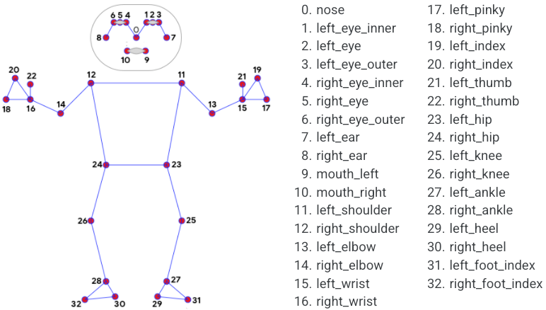
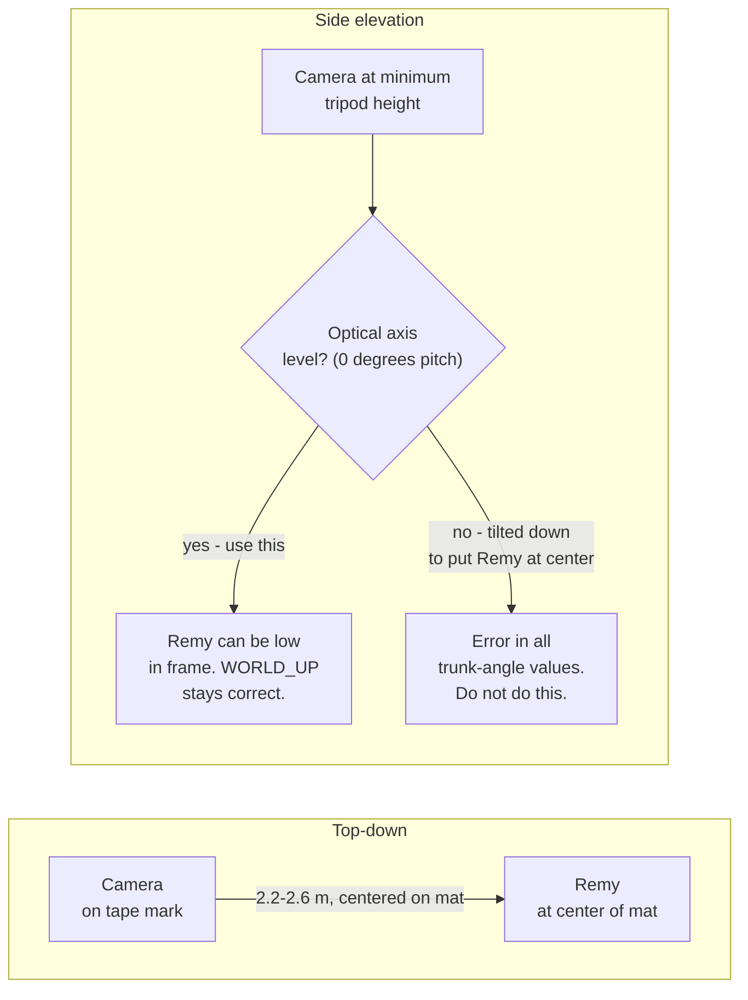
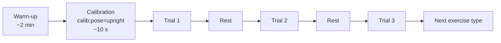

# Data Collection Protocol — Verification & Validation

*remapy / motor_metrics · rev. 2026-10-05*

This document is a measurement plan for one subject. It shows if the sitting, transition, crawl,
and standing metrics measure the real movement of Remy. The metrics must not show errors from
the camera, the model, or the filter chain.

| | |
|---|---|
| **Subject** | n = 1 (Remy) |
| **Instruments under test** | hold · transition · crawl |
| **Design** | Single-case, repeated-measures |
| **Reference standard** | Manual video reference (no lab hardware) |

## Purpose of this document

*Verification* answers this question: does the code calculate the correct value? This work is
complete. `tests/test_motor_metrics.py` compares each metric with a known closed-form result. For
example, it uses a constructed lean angle, the exact perimeter of a polygon, and a known sine
frequency. At the time of this protocol, 441 tests passed. This document does not discuss code
correctness.

*Validation* answers a different question: do the numbers show a real property of the movement of
Remy? Only data that you collect for this purpose can answer this question. This document is the
plan for that data collection.

All published reliability values for this type of measurement come from group studies. These
studies have 10–20 or more subjects, and they use the ICC. The ICC compares the variance between
persons, so it needs more than one person. Thus, it does not apply to one child.

This protocol uses the procedures of single-case experimental design (SCED).[^1] It uses these
three methods:

- Repeated measurements of the same subject.
- An estimate of the measurement error from repeated trials.
- Known-contrast checks, in place of a population reference range.

## Three different questions

The question "Is this metric valid?" contains three different questions. A session that answers
one question does not answer the other two. Plan each collection day for one of these questions.

| Question | Answered by | Applies to |
|---|---|---|
| **Reliability** — if nothing changed, does the number stay the same? | Repeat trials on the same day. Report the SEM and the MDC95 (see the Reliability sub-study section). | All metrics |
| **Concurrent validity** — does the metric agree with a different method that measures the same property? | A manual reference measurement, collected at the same time as the camera data (see the Concurrent validity section). | Duration, scale, trunk angle, cadence, reciprocity |
| **Sensitivity** — does the metric change when the movement really changed? | A fatigue contrast in one session, and the trend from month to month (see the Sensitivity section). | Sway, SPARC, cadence |

> **CAUTION:** The sway metrics (path length, ellipse area, RMS) have no concurrent validity check
> in this protocol. There is no force plate or marker system at home. Thus, sway is the metric
> family with the least independent confirmation. The Concurrent validity section gives the best
> available substitute. The protocol accepts this limit. See the Limitations section.

## Why this protocol must be careful

Two published results give the expected performance before the first recording.

### The best lab equipment is only moderately reliable in this population

One study examined the sitting posture control of infants with cerebral palsy (CP), or at risk of
CP.[^2] This population is the reference population for Remy. The study used a **240 Hz force
plate**. Each session had three trials of 8.3 s, and the study had 18 infants (mean age 13.1
months).

With this equipment, the reliability between sessions was only moderate for the linear sway
measures:

| Measure | Inter-session ICC (mean) | Range |
|---|---:|---:|
| RMS, anterior–posterior sway | 0.59 | 0.44 – 0.78 |
| RMS, medio-lateral sway | 0.55 | 0.25 – 0.70 |
| Sway path length | 0.43 | 0.25 – 0.57 |

These values are the maximum reliability of a special lab instrument. A single 30 Hz webcam will
probably not be better. The objective of this protocol is to find how much worse the webcam is.

### The landmark noise and the signal are approximately the same size

One study compared pose estimation without markers to motion capture with markers.[^3] It found
these landmark position errors:

- Approximately 47% of the errors were less than 20 mm.
- Approximately 80% of the errors were less than 30 mm.
- Approximately 10% of the errors were more than 40 mm.

The postural sway of Remy is less than 10 cm. Thus, the landmark noise is not small in comparison
with the signal. The noise and the signal have approximately the same size.

The meter values are also an output of the model. `landmarks_world` has metric units because
MediaPipe estimates a body scale from the pose. No object in the image calibrates it.

Thus, an object of known size in the frame cannot check the scale. The pose landmarker gives only
the 33 body points. A rod in the frame gets no coordinates, and its size has no effect on the
estimate of the model.

For this reason, the scale check in the Concurrent validity section uses a body dimension. You
measure this dimension with a tape measure. It is the only reference that this pipeline can use.

### The landmarks that the metrics use

All metrics in this package use a small set of the 33 body landmarks of MediaPipe:

- The shoulders and the hips (11, 12, 23, 24) give the trunk vector. All hold metrics and all
  transition metrics use the trunk vector.
- The wrists (15, 16) give the crawl signal.

The camera framing (see the next section) has one function. It must keep all of these landmarks
in the frame, with nothing in front of them, for the full trial.

*Fig. 1 — The 33-point MediaPipe Pose landmark map. All metrics in this package use the shoulders
and hips (11, 12, 23, 24) and the wrists (15, 16). Source: Google AI Edge,
[Pose landmark detection guide](https://developers.google.com/edge/mediapipe/solutions/vision/pose_landmarker),
licensed [CC BY 4.0](https://creativecommons.org/licenses/by/4.0/).*

## Fixed setup — the same in each session

All metrics are correct only if the camera does not move or tilt between sessions. `signals.WORLD_UP` uses
the vertical axis of the camera as "up". This is correct only if the camera is level. Set the
equipment one time, mark its position, and use the marks in each session.

**The level (zero pitch) is the important requirement. The height of the camera is not
important.**

- `WORLD_UP` needs a horizontal optical axis. It does not need a specified camera height.
- If the minimum height of the tripod is above the seated hip height of Remy, use the tripod at
  that height. Keep the camera level. Remy is then low in the frame, and `WORLD_UP` stays correct.
- A downward tilt causes the error. If you tilt the camera down to put Remy at the center, the
  "up" axis of the camera turns away from the true vertical. The angle of this change is
  approximately the tilt angle. All `trunk_from_vertical` values then have this error.
- The height has a smaller effect. When Remy is near the principal axis of the camera, the lens
  causes less distortion. The distortion increases near the edges of the frame.

```mermaid
flowchart LR
    subgraph TopDown [Top-down]
        direction LR
        C1["Camera<br/>on tape mark"] -->|"2.2-2.6 m, centered on mat"| K1["Remy<br/>at center of mat"]
    end
    subgraph SideElevation [Side elevation]
        direction TB
        C2["Camera at minimum<br/>tripod height"] --> D{"Optical axis<br/>level? (0 degrees pitch)"}
        D -->|"yes - use this"| K2["Remy can be low<br/>in frame. WORLD_UP<br/>stays correct."]
        D -->|"no - tilted down<br/>to put Remy at center"| K3["Error in all<br/>trunk-angle values.<br/>Do not do this."]
    end
```

*Fig. 2 — Fixed camera geometry (schematic, not to scale). Use the height that the tripod gives.
The important condition is a level optical axis. The physical height is not important.*

*Mark the camera and mat positions with floor tape. Then the distance and framing are the same
in all sessions. Before each recording, use a bubble level or a phone level app to make sure that the
camera is level. `trunk_from_vertical` needs a level camera.*

- [ ] **Camera level** — Before each recording, put a bubble level or a phone level app on the
      camera body. All trunk-angle values and sway values need a level camera.
      This is true at all mounting heights.
- [ ] **Fixed distance** — Mark the camera position and the child position with floor tape
      (Fig. 2). Then the framing and the `com_norm` speed scale stay the same in all sessions.
      If a tall tripod puts the camera much higher than the hips of Remy, increase the distance.
      At a larger distance, the height difference causes a smaller angle. Use this solution
      before you tilt the camera.
- [ ] **Full-body framing check** — Use your fixed height and distance. Make sure that the
      shoulders, the hips, and the two wrists are in the frame with a margin. Do this check also
      when Remy is low or high in the frame. A tall mount causes only this framing limit. It does
      not cause a validity problem.
- [ ] **Same surface and light** — Use the same mat and the same room, at an equivalent time of
      day. Then a change in the visibility scores or presence scores shows a change in tracking,
      not a change of room.
- [ ] **Body-scale reference** — Measure the body away from the camera. Do not hold an object in
      the frame. Use a tape measure to measure the shoulder width of Remy (acromion to acromion)
      and his hip width. Write the values in the session notes. Measure again each month,
      because Remy grows. An old value would look like a scale drift. The scale check in the
      Concurrent validity section uses these values. The software does this check later, with
      the `calib` segment.

> **CAUTION:** Do not tilt the camera if you can prevent it. If a tilt is necessary, measure the
> tilt angle accurately with a protractor or a level app. Do not estimate it by eye. Use the same
> angle in each session.
>
> A tripod head without an angle stop makes this difficult. A tilt that changes between sessions
> causes noise between sessions. For trend detection, this noise is worse than a constant offset.
>
> Do not use `signals.estimate_up()` to correct a tilt. This function cannot find the difference
> between a tilted camera and a child who does not sit vertically. A child with a developmental
> delay can sit at an angle. Thus, this function adds the problem that this setup must prevent. A
> larger distance (see the Fixed distance item) is the better solution.

## Session structure

Each session starts with a calibration segment. Then, for each exercise type, the session has
short blocks of trials, with rest between the trials. The infant CP sitting study (see the
previous section) used three trials for each type. That study is the published study nearest to
this population, so this protocol uses the same design.

```mermaid
flowchart LR
    A["Warm-up<br/>~2 min"] --> B["Calibration<br/>calib;pose=upright<br/>~10 s"]
    B --> C1["Trial 1"]
    C1 --> R1["Rest"]
    R1 --> C2["Trial 2"]
    C2 --> R2["Rest"]
    R2 --> C3["Trial 3"]
    C3 --> N["Next exercise type"]
```

*Fig. 3 — Session structure for one exercise type. Do this for each of the four exercise types.
Change the sequence of the types in each session. The trial length is different for each
exercise.*

*A sitting hold or a standing hold continues until Remy stops or loses the posture.
Transitions and crawls are short. Do not hurry the rest between trials. This is not a timed
clinical test.*

- **Always start with `calib;pose=upright`.** The notebook uses this segment as the vertical
  reference before you use a hold number (see the Data quality gates section).

  > **WARNING:** Record the calibration in each session, also in a short session. If you do not
  > record it, you cannot use the data from that day.

- **Do three trials of each exercise type in each session.** The infant CP sitting study used the
  same number. If Remy is tired before the third trial, record the trials that you have. Write a
  note about it. A day with two trials is satisfactory, but the error estimate is larger.
- **Change the exercise sequence in each session.** For example, use sit → stand → transition →
  crawl on one day. Then use crawl → sit → transition → stand on the next day. Thus,
  fatigue does not always have an effect on the same exercise.
- **Use the label vocabulary immediately.** For example, type `sit_hold;arms=free;support=none`.
  Do not type free text. The `warnings` column of `metrics_table()` shows a spelling error. But it
  can find the error only in a structured label.

## Reliability sub-study — estimate the measurement error

Do this three-week block before you use the metrics for a long-term trend. The objective is a
number for the change in a metric when no real change occurs. Then you can identify a real change
later, because it is larger than the noise.

### Schedule

1. Do two sessions each day, with a minimum of two hours between them. For example, do one late
   in the morning and one late in the afternoon.
2. Do this on 3 days each week for 3 weeks. This gives nine same-day pairs.

Remy does not develop much in one day. Thus, the difference between the morning session and the
afternoon session is measurement error. It is not a change in Remy.

### Analysis for n = 1

> **NOTE:** Do not use the ICC. The ICC divides the variance between subjects by the total
> variance. Thus, it needs more than one subject. Use the within-subject method. The repeated
> trials give the data for this method directly.

1. For each metric, put together the repeat trials in a same-day pair. You can also use all three
   trials in a block. Calculate the **standard deviation in one day**, `SD_within`.
2. Calculate the **standard error of measurement**: `SEM = SD_within`. Do not apply a correction
   with a reliability coefficient. This value is the direct estimate of the noise between trials.
3. Calculate the **minimum detectable change**: `MDC95 = 1.96 × √2 × SEM`.[^4] This value is the
   smallest change between two sessions that is probably real. The confidence level is 95%.
4. Report `SEM` and `MDC95` for each metric. Do not report one combined number. Sway and cadence
   do not have the same noise level.

Until this sub-study is complete, use the inter-session spread of the infant CP study as the
noise limit. This spread is in the ICC table in the previous section. If a change between two
sessions is smaller than this spread, it is probably noise. This is the best estimate of the
measurement error for these sway values, until you calculate the `MDC95` of Remy.

## Concurrent validity — an independent check for each metric family

There is no force plate or marker system at home. Thus, "independent" in this section means a
manual reference. A person makes this reference from the same video. It is less accurate than a
lab instrument. But it does not use the pose-estimation pipeline, so it is independent.

| Metric family | Reference standard | Agreement check |
|---|---|---|
| `duration_s` | A stopwatch, or a person reads the video timestamp at the in and out points | Must agree within one frame (33 ms). This is a sanity check more than a validity test. |
| Metric scale (all sway numbers use it) | The shoulder width from the session notes, measured with a tape measure (see the Fixed setup checklist) | Compare it with the median distance between landmarks 11 and 12 in `landmarks_world` during the `calib` segment. The ratio must *stay the same* across sessions. A sudden change shows that MediaPipe changed the scale of Remy. The meter values of that session then do not compare with other sessions. Angles and ratios do not change. |
| `trunk_angle_mean_deg` | Freeze a frame from the `calib` segment. Measure the trunk angle from vertical on the image with a protractor or an inclinometer app. | Must agree with `trunk_from_vertical` within a few degrees. |
| Postural sway (path length, ellipse, RMS) | *There is no reference standard at home.* The best substitute is a second phone camera at a different angle. Compare the sway size qualitatively (larger or smaller), not as a number. | This shows that the sway is not an error of one camera. It does not validate the absolute size (see the Limitations section). |
| `cadence_cpm` (crawl) | A person counts the arm pulls in the recorded video, with a stopwatch and a tally or frame by frame in `annotate`. | The manual count × 60 / trial seconds must agree with `cadence_cpm_left` / `_right` within one or two pulls. |
| `phase_offset` (crawl reciprocity) | A person puts the same video clip into one of three groups: reciprocal (alternating), symmetric ("bunny" haul), or mixed. | `phase_offset` must be near 0.5 for "reciprocal" clips and near 0.0 for "symmetric" clips. |
| `sparc_trunk` (transition smoothness) | *There is no independent smoothness reference* in this protocol or in published protocols. SPARC compares only with itself (see `motor_metrics/transition.py`). | Use the known-contrast design in the Sensitivity section. Do not use a concurrent reference. |

Do the scale check and the trunk-angle check in the first session of each reliability block, as a
minimum. These two checks are fast, and the software does them later with the `calib` segment.

- A tilted camera causes an error in all trunk-angle values and sway values.
- A change in the metric scale stops the comparison of the sway values between sessions. Sway is
  the only metric family that has units.

## Sensitivity — make sure that a metric changes when the movement changes

The reliability sub-study shows if a metric *stays the same* when nothing changes. The sensitivity
check shows if the metric *changes* when something changes. Use two designs, on two time scales.

### Short time scale: fatigue in one session

Compare trial 1 with trial 3 in the same block. Expect a real change when Remy becomes tired. For
example, the sway can increase, or the SPARC smoothness can decrease, at the end of the block.

A metric can show no difference between trial 1 and trial 3 in many sessions. There are two
possible causes:

- The metric is not sensitive at the resolution of this setup.
- The exercise does not cause fatigue.

Find which cause is correct. Do not guess.

### Long time scale: the monthly trend and the reports of the physical therapist

There is no independent numerical score for calibration. Remy does not have a series of GMFM
scores from a physical therapist (see `motor_metrics/CLAUDE.md`). Use this check as an
approximate check, not as a statistical test.

1. Wait until his physical therapist or you see a change in his ability.
2. Look at the trend of the related metric (duration, sway, or cadence) during the same period.
3. Make sure that the trend moved in the same direction.

If the trend agrees, the metric is probably correct. If it does not agree, first examine the
coverage and quality data (see the Data quality gates section). Then examine the metric.

## Data quality gates — do these checks in each session before you use the data

The code already has quality gates (`motor_metrics.quality`,
`Gate(min_visibility=0.5, min_presence=0.5)`). These checks agree with the code gates. A person
does these checks by eye. This section does not repeat the automatic checks of the code.

- [ ] **Coverage ≥ 0.8** for each trial. A lower `coverage` value in `metrics_table()` shows a
      problem. MediaPipe did not find the torso for more than 20% of the clip. Then the numbers are only
      approximate. Record the trial again. Do not try to analyze it again.
- [ ] **`tracked_s` is near `duration_s`.** A large difference shows that the longest good
      tracking run was much shorter than the marked trial. Usually, something blocked the camera
      during the trial. For example, an arm went across the torso, or a person helped with a hand.
- [ ] **The `warnings` column is empty.** A value in this column shows an error in a label
      (`label_warnings()`). Correct the annotation before you use the row.
- [ ] **The calibration result is near zero.** The vertical-reference check of the notebook gives
      the median trunk angle during the `calib` segment. This angle must be near 0°. If it is
      not, the camera had a tilt for that full session. Make the camera level before the next
      session. The trunk-angle values and sway values of that session have an unknown error from
      the tilt.

> **CAUTION:** Do not try to repair a bad trial. If the coverage is less than 0.5, mark the
> segment `exclude;reason=...` and record the trial again. Do the same if an interruption occurs
> during the trial.
>
> `segments.py` removes all of each trial that touches an `exclude` segment. It does not cut the
> bad part from the trial. A hold with a bad middle part is not a shorter good hold.

## Data management

- **File name:** `YYYY-MM-DD_HHMM_<setupid>.h5`. The setup id changes only when you move the
  camera to a different position. Thus, the setup id shows each session that used a geometry
  different from Fig. 2.
- **Keep all raw `.h5` files.** Do not delete them. The software calculates the metrics each time
  that it reads a file. It does not write them back to the file. `recording/recorder.py` uses
  the same rule. After a change to the filter constants in `derive.py`, you can calculate all old
  sessions again.
- **Write the code version (git commit hash) with each set of exported metrics.** You can compare
  `SPARC` and sway velocity only when the same filter chain calculated them. A change to the
  constants in `derive.py` stops the comparison. The commit hash shows if a number is from before
  or after the change.
- **Keep the raw repeat trials of the reliability sub-study apart from the usual trend sessions.**
  Then you can calculate `SEM` and `MDC95` again later, without a manual sort of all files.

## Limitations

- **n = 1.** These results do not apply to other children. All conclusions are about Remy and his
  own baseline.
- **There is no lab-grade reference for sway.** The force-plate values of the infant CP study give
  the best context for good reliability in this population. This setup does not have to give the
  same values.
- **The metric scale is an estimate of the model. It is not a calibration.**
  - MediaPipe estimates the body size of Remy from the pose. The meter values in
    `landmarks_world` come from this estimate.
  - A recording from one camera has no calibration, and an object in the frame cannot give one.
  - The body-dimension check finds a *drift* in the estimate between sessions. It cannot show the
    absolute accuracy. No method at home can show it.
  - Ratios and angles (`trunk_angle_*`, `phase_offset`, `cadence_cpm`, `sparc_trunk`) do not use
    the scale. The sway metrics use it.
- **SPARC has no external reference**, in this protocol or in published studies. SPARC is
  consistent with itself, and it resists noise up to a limit. It is not an absolute score. The
  known-contrast design in the Sensitivity section is the only validity data for SPARC.
- **The protocol uses only the camera.** The Feather Sense IMU is not in this phase (see
  `motor_metrics/CLAUDE.md`). Thus, there is no inertial check of the sway or the trunk angle.
- **The manual reference standards also have errors.** A person who counts arm pulls or reads a
  protractor on a frozen frame can make errors. Use the concurrent validity checks to find large
  disagreements. They do not prove precision.

## References

[^1]: Krasny-Pacini, A. & Evans, J. Single-case experimental designs to assess intervention effectiveness in rehabilitation: a practical guide. *Annals of Physical and Rehabilitation Medicine*, 2018. https://www.sciencedirect.com/science/article/pii/S1877065717304542

[^2]: Reliability of Center of Pressure Measures for Assessing the Development of Sitting Postural Control in Infants With or at Risk of Cerebral Palsy. https://pmc.ncbi.nlm.nih.gov/articles/PMC2948026/

[^3]: Needham, L. et al. Evaluation of 3D Markerless Motion Capture Accuracy Using OpenPose With Multiple Video Cameras. 2020. https://pmc.ncbi.nlm.nih.gov/articles/PMC7739760/

[^4]: Standard MDC95 = SEM × 1.96 × √2 formulation, as applied throughout the rehabilitation measurement literature (e.g. mobility measures in community-dwelling adults, https://pmc.ncbi.nlm.nih.gov/articles/PMC6858113/).

[^5]: Balasubramanian, S. et al. A robust and sensitive metric for quantifying movement smoothness. *IEEE Transactions on Biomedical Engineering*, 2012. https://pubmed.ncbi.nlm.nih.gov/22180502/ — the SPARC metric this protocol's Sensitivity known-contrast design is built around.

[^6]: Google AI Edge. *Pose landmark detection guide* — source of the 33-landmark diagram in Fig. 1. https://developers.google.com/edge/mediapipe/solutions/vision/pose_landmarker — [CC BY 4.0](https://creativecommons.org/licenses/by/4.0/).

---

*remapy / motor_metrics — data collection protocol — draft for review before the first reliability-block session*
